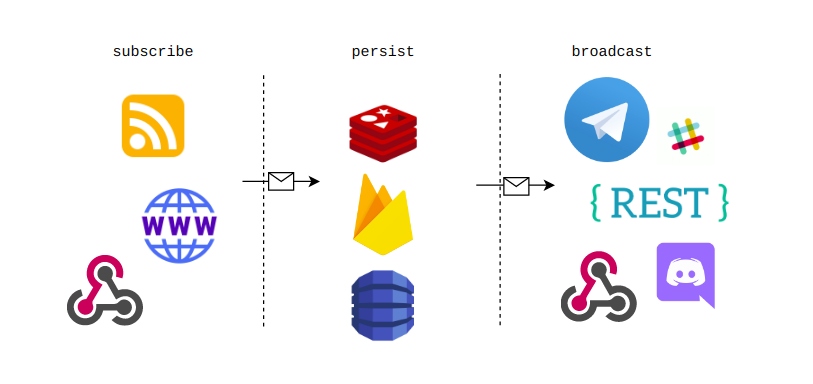

# Newspopper

Subscribe to any feed or web, deliver anywhere!

## Overview



### V2 Roadmap

#### Subscriber
- [x] rss
- [x] web/scrap
- [x] webhook

### Persistence
- [x] redis
- [ ] firebase
- [ ] dynamo

### Broadcaster
- [x] telegram channel
- [x] stdout (for debugging)
- [ ] discord
- [ ] slack
- [x] webhook

### Other
- [ ] proxy

## Prerequisite

To run this program, you will need

### List System & App Dependencies

```$xslt
- Golang 1.10+
- Go Mod Enabled
- Redis
```

## How to Run

- Copy environment file from `sites.yaml.example` to be `sites.yaml`, add your favourite site there
- Verify and download dependencies `make dep`
- Run the app `make run`

## How to Run with Docker and docker-compose

> Easy to **Build**, **Run**, **Stop** and **Logging**

> Using this way you have persistent redis data in: `docker/volume/data-redis`

> Just place your `sites.yaml` file with a valid configuration and get your bot up and running!

- Copy environment file from `sites.yaml.example.docker` to be `sites.yaml`, add your favourite site there
- Buid the app image `make docker-build`
- Run the continers app `make docker-compose-up`
- Stop the continers  app `make docker-compose-down`
- Inspect the continers app logs `make docker-logs-follow`

```shell
❯ docker images
REPOSITORY          TAG                IMAGE ID       CREATED             SIZE
rzkmak/newspopper   0.0.3              0af78e9bd103   About an hour ago   22.5MB
```

## How to Simulate

- Setup dev environment properly
- Update sites.yaml to be desired value, put `stdout` value in your target.

For example:
```$xslt
listener:
- type: "rss"
  url: "http://your-site.com/feed"
  interval: 1m
  target: "stdout"
```
